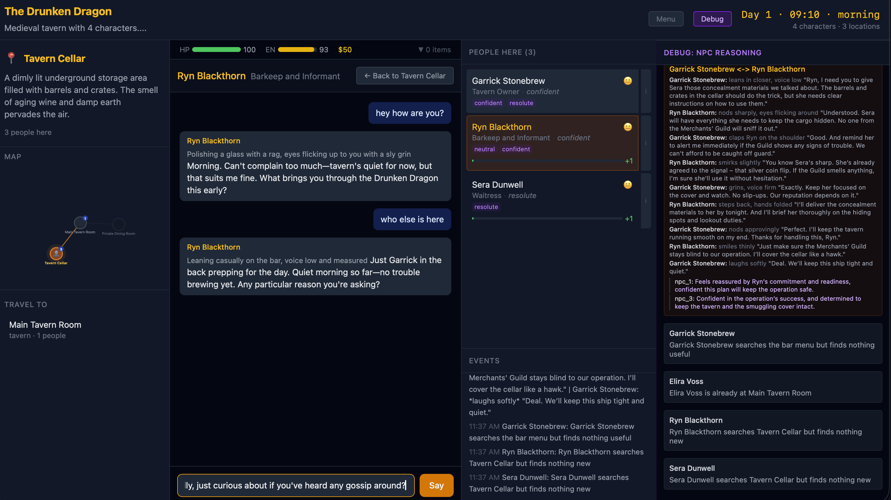
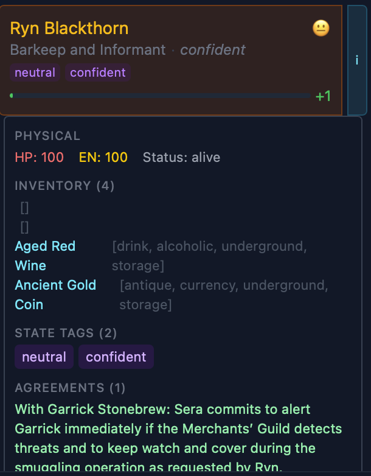
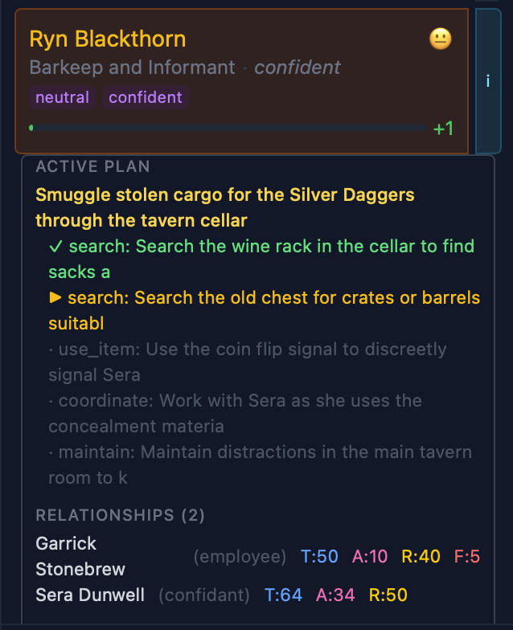

# The Unnamed Town — LLM-Powered Text Adventure

[](LICENSE)
[](https://www.typescriptlang.org/)
[](https://react.dev/)
[](https://nodejs.org/)
[](https://openai.com/)
[](https://www.postgresql.org/)
[](https://www.docker.com/)
[](https://claude.ai/code)

**An emergent text adventure where NPCs are fully autonomous agents powered by LLM.** They form plans, have real conversations, make agreements, fight, seduce, scheme, and remember everything. The player can talk freely, take any action, and shape the world.

---

## Screenshots


*The full game interface: a conversation with Ryn Blackthorn (barkeep and informant) in the Tavern Cellar, while the debug panel shows live NPC reasoning — Garrick Stonebrew negotiating with Ryn, Sera Dunwell agreeing to cover for the smuggling operation. The event log on the right tracks NPC actions happening autonomously in the background.*

<p float="left">
  
  
</p>

*Inspecting Ryn Blackthorn's character sheet. Left: physical state (HP/energy), inventory (Aged Red Wine, Ancient Gold Coin), state tags, and a live agreement with Garrick — "Sera commits to alert Garrick if the Merchants' Guild detects threats." Right: Ryn's active multi-step plan — "Smuggle stolen cargo for the Silver Daggers through the tavern cellar" — with completed steps (✓), the current step (▶), and upcoming steps. Every NPC in the world is running a plan like this simultaneously, without any player input.*

---

## What it does

- **Fully autonomous NPCs** — each NPC has a secret goal, forms multi-step plans, executes them step by step, and replans when things go wrong. All without the player doing anything.
- **Real NPC-to-NPC conversations** — NPCs seek each other out based on overlapping plans and relationships, negotiate, form agreements, and transfer items. Agreements trigger replanning for all parties.
- **Living memory** — NPCs remember everything with importance/recency/relevance scoring (Stanford Generative Agents-inspired). Convince one NPC of something and watch the belief propagate across the town.
- **Physical world** — combat produces HP damage, injuries, and state tags. Tags (`injured`, `drunk`, `armed`, `confident`) are visible to other NPCs, affect action probability, and change how NPCs treat each other.
- **Game Master** — every player action and NPC plan step is adjudicated by an LLM referee with probability bands (5–90%), producing narrative outcomes with real consequences.
- **Full debug visibility** — toggle the debug panel to watch NPC reasoning chains, live conversations, and plan execution in real time.
- **Docker-ready** — one command to run with PostgreSQL

---

## Quick Start

### Docker (recommended)

```bash
cp .env.example .env        # add your OPENAI_API_KEY
docker compose -f docker-compose.dev.yml up
```

Open **http://localhost:5173**. Pick a preset or describe your own world. Generate. Play.

### Without Docker

```bash
npm install
cp .env.example .env        # add your OPENAI_API_KEY + DATABASE_URL
npm run dev                  # starts server (:3001) + frontend (:5173)
```

Requires a running PostgreSQL instance. Set `DATABASE_URL` in `.env`.

---

## Tech Stack

| Layer | Technology |
|-------|-----------|
| Frontend | React 19 + TypeScript + Vite + Tailwind CSS |
| Backend | Node.js + Express |
| LLM | OpenAI API (gpt-4o for world gen, gpt-4.1-mini for simulation) |
| Database | PostgreSQL 16 |
| State | Zustand (client), in-memory + PostgreSQL (server) |

---

## Architecture

```
server/
  db/            — PostgreSQL persistence
  game/state.ts  — All state mutations, memory scoring, item transfer
  llm/           — OpenAI integration: client, prompts, judge, world gen, portraits
  routes/        — Express API: actions, chat, game state, navigation, SSE events
  simulation/    — Tick engine, NPC planning, conversations, reflection, social AI

shared/
  types.ts       — All TypeScript type definitions
  constants.ts   — Tunable configuration (memory weights, LLM models, thresholds)

src/
  components/    — React UI: chat panel, NPC list, world map, debug tools
  stores/        — Zustand game state
  hooks/         — SSE listener, chat integration
```

### Core Systems

**Memory** — Stanford Generative Agents-inspired retrieval: `score = importance * 2.0 + recency * 0.5 + relevance * 3.0`. Top 30 memories injected per prompt. Periodic consolidation compresses old memories into summaries.

**Planning** — Activation-energy gating triggers plan formation. LLM generates 2-6 step plans with full world context. Steps execute through the Game Master with auto-travel, social action detection, and physical consequence routing.

**Conversations** — Need-driven pairing (NPCs only talk when they have a reason). 8-15 lines of dialogue per conversation. Prior dialogue history prevents repetition. Agreements trigger replanning for all participants.

**Game Master** — Adjudicates any action with probability bands (5-90%). Combat produces HP damage, injuries, and tags. Forced minimum effects ensure actions have consequences.

**Tags** — Open-ended state system. NPCs gain tags from combat (`injured`, `bleeding`), conversations (`scared`, `confident`), and agreements (`nude`, `armed`). Tags are visible to other NPCs, affect action probability, and influence planning.

**Reflection** — Event-driven (significant events trigger immediate reflection) plus periodic (every 8 ticks). Reflection can trigger replanning and player approach.

---

## UI

| Panel | Contents |
|-------|----------|
| **Left** | Location info, SVG map, travel buttons |
| **Center** | Talk mode (amber) / Act mode (green), player status, group sessions |
| **Right** | NPC list with inspect panels, event log |
| **Debug** (toggle) | NPC reasoning, conversation dialogue, plan steps |

---

## Configuration

Key settings in `shared/constants.ts`:

| Setting | Default | Purpose |
|---------|---------|---------|
| `LLM_MODELS.conversation` | `gpt-4.1-mini` | Model for NPC dialogue and planning |
| `LLM_MODELS.worldGen` | `gpt-4o` | Model for world generation |
| `TOP_K_MEMORIES` | 30 | Memories injected per NPC prompt |
| `MAX_KNOWLEDGE_PER_NPC` | 150 | Memory cap before consolidation |
| `ACTIONS_PER_TICK` | 2 | Player actions per simulation tick |
| `MAX_NPC_CONVERSATIONS_PER_TICK` | 3 | Concurrent NPC-NPC conversations |
| `ENABLE_PORTRAITS` | `false` | DALL-E 3 portrait generation (~$0.04/image) |

---

## Cost Estimates

| Operation | Cost |
|-----------|------|
| Player chat | ~$0.001 |
| NPC conversation | ~$0.001 |
| Plan formation | ~$0.001 |
| World generation (gpt-4o) | ~$0.30 |
| **Per hour of gameplay** | **~$0.50-1.00** |

---

## Testing

```bash
npm run test:smoke           # 60 unit tests, free, no API key required
npm run typecheck            # TypeScript type check
npm run test                 # integration tests — requires API key (~$0.05 per run)
```

---

## Contributing

See [CONTRIBUTING.md](CONTRIBUTING.md) for setup guide, code style, and areas where we need help.

## License

[MIT](LICENSE)
